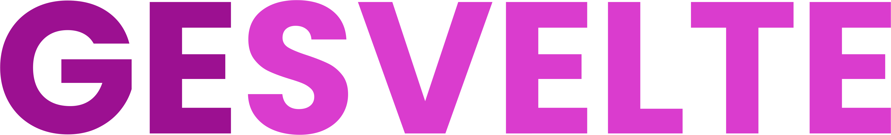

<!-- LOGO -->
<div align='center' >
    
</div>

<!-- README HEADER -->

# geSvelte


    

<a name="readme-top"></a>

Simplify form building for your website or web application with [geSvelte](http://gesvelte.io) - a custom form builder for Svelte developers powered by SvelteKit.
[geSvelte](http://gesvelte.io) offers a simple, easy to use, and intuitive Svelte form-building interface with live preview, and an accompanying npm package to acceses the Svelte form components.

As a product built under the open-source tech accelerator OS Labs, [geSvelte](http://gesvelte.io) is continuously growing and improving to better serve the needs of developers.

<!-- TABLE OF CONTENTS -->

### Table of Contents

<ol>
  <li>
    <a href="#about-the-project">About The Project</a>
    <ul>
      <li><a href="#built-with">Built With</a></li>
      <li><a href="#features">Features</a></li>
    </ul>
  </li>
  <li><a href="#using-gesvelte">Using geSvelte</a></li>
  <li><a href="#future-release-plans">Future Release Plans</a></li>
  <li><a href="#contributing">Contributing</a></li>
  <li><a href="#authors">Authors</a></li>
  <li><a href="#acknowledgments">Acknowledgments</a></li>
  <li><a href="#license">License</a></li>
</ol>

<!-- ABOUT THE PROJECT -->

## About The Project

### Built With

[![Svelte][Svelte.dev]][Svelte-url] [![Vite][Vite.js]][Vite-url] [![Sass][Sass]][Sass-url] [![TypeScript][TypeScript]][TypeScript-url]

<!-- Typescript/Javascript, Vite, SvelteKit, Scss -->

### Features

- Custom no-code Svelte form creation interface with live form preview
- Built-in form field validation
- Accessibility-tested form components
- Live component code preview that lets you copy and paste the form code direclty into your applicaiton

<p align="right">(<a href="#readme-top">back to top</a>)</p>

<!-- USING -->

## Using geSvelte

You can take advantage of everything that geSvelte has to offer if you visit [gesvelte.io](http://gesvelte.io/stage).

However, if you'd like to run the application directly from your machine, follow these steps:

1. Fork and then clone the repo:

```
git clone https://github.com/oslabs-beta/geSvelte.git
```

2. Install dependencies:

```
npm install
```

3. Start the app:

```
npm run dev
```

<p align="right">(<a href="#readme-top">back to top</a>)</p>

<!-- RELEASE PLANS -->

## Future Release Plans

Features currently in development:

- npm package to access the form components
- Completed documentation
- More style themes available
- More pre-composed form options available (dropdown, etc)
- Multi-step forms

Upcoming release: TBD

<p align="right">(<a href="#readme-top">back to top</a>)</p>

<!-- CONTRIBUTING -->

## Contributing

Contributions are always welcome!

See `CONTRIBUTING.md` for ways to get started.

Please adhere to this project's code of conduct in `CODE_OF_CONDUCT.md`

<p align="right">(<a href="#readme-top">back to top</a>)</p>

<!-- AUTHORS -->

## Authors

| Active developers |                                                                                                                                                |                                                                                                                                                        |
| ----------------- | ---------------------------------------------------------------------------------------------------------------------------------------------- | ------------------------------------------------------------------------------------------------------------------------------------------------------ |
| Christian Ashley  | [](https://github.com/Enixun)      | [](https://www.linkedin.com/in/christian-z-ashley/)      |
| Johnny Howell     | [](https://github.com/jh1551)      | [](https://www.linkedin.com/in/john-howell-73a2b833/)    |
| Stefan Jordan     | [](https://github.com/sjordan2010) | [](https://www.linkedin.com/in/stefan-jordan-3a466054)   |
| Ksenia Salova     | [](https://github.com/ksslv)       | [](https://www.linkedin.com/in/ksenia-s/)                |
| Umair Shafiq      | [](https://github.com/mooselamb)   | [](hhttps://www.linkedin.com/in/umair-shafiq-69a419261/) |

<p align="right">(<a href="#readme-top">back to top</a>)</p>

<!-- ACKNOWLEDGMENTS -->

## Acknowledgments

Thank you to Stephanie, Debbie, and the Svelvet developers for their support.

<p align="right">(<a href="#readme-top">back to top</a>)</p>

<!-- LICENSE -->

## License

Distributed under the MIT License. See `LICENSE` for more information.

<p align="right">(<a href="#readme-top">back to top</a>)</p>

<!-- Library of badges -->

[Next.js]: https://img.shields.io/badge/next.js-000000?style=for-the-badge&logo=nextdotjs&logoColor=white
[Svelte.dev]: https://img.shields.io/badge/Svelte-4A4A55?style=for-the-badge&logo=svelte&logoColor=FF3E00
[Svelte-url]: https://svelte.dev/
[Vite-url]: https://vitejs.dev/
[Vite.js]: https://img.shields.io/badge/vite-%23646CFF.svg?style=for-the-badge&logo=vite&logoColor=white
[Sass-url]: https://sass-lang.com
[Sass]: https://img.shields.io/badge/-Sass-CC6699?logo=sass&logoColor=white&style=for-the-badge
[TypeScript]: https://img.shields.io/badge/TypeScript-3178C6?style=for-the-badge&logo=TypeScript&logoColor=FFFFFF
[TypeScript-url]: https://www.typescriptlang.org
